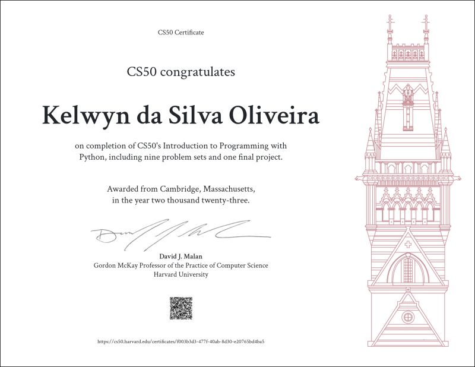

# HarvardX: CS50's Introduction to Programming with Python

This repository contains my personal solutions to the problem sets from the [CS50's Introduction to Programming with Python](https://cs50.harvard.edu/python/2022/), offered by Harvard University.

---

📚 **Purpose**  
This project documents my progress through the CS50 Python course, covering topics such as:

1. [Functions, Variables](./01-functions-variables/)
1. [Conditionals](./02-conditionals/)
1. [Loops](./03-loops/)
1. [Exceptions](./04-exceptions/)
1. [Libraries](./05-libraries/)
1. [Unit Tests](./06-unit-tests/)
1. [File I/O](./07-file-I-O/)
1. [Regular Expressions](./08-regular-expressions/)
1. [Object-Oriented Program](./09-oop/)
1. [Final Project - Kanpy](./final_project/)

Each folder represents an individual exercise completed as part of the course, aiming to build strong programming fundamentals using Python.

---

🧠 **Why this matters**  
While these are structured assignments from a world-class curriculum, the real value was in developing problem-solving skills, logical thinking, and code clarity.

---

🚀 **Note**  
This repository is part of my learning journey and is not intended to represent production-level code.

